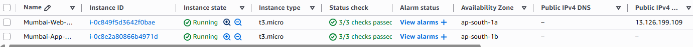
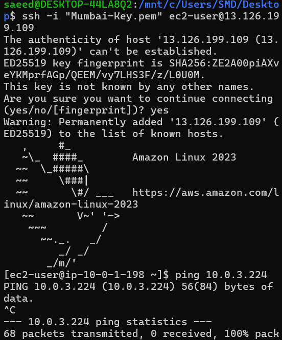
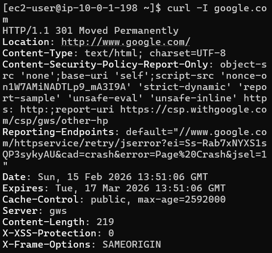
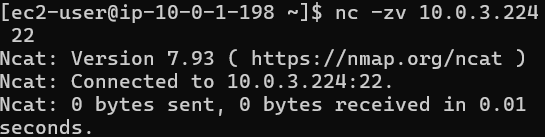
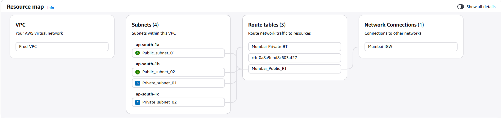

# Secure Two-Tier Cloud Network (AWS Mumbai)

This project demonstrates the deployment of a secure, highly available two-tier architecture in AWS. It follows the "least privilege" security model, separating public-facing web servers from protected private application layers across three Availability Zones.
## 📖 Detailed Documentation
For a comprehensive, step-by-step walkthrough of every click in the AWS Console, please refer to the full technical guide:

👉 **step by step instructions[Download](./Secure-Two-Tier-Cloud-Architecture.docx)**

---

## 🏗️ Phase 1: The Network Foundation

### VPC Configuration
* **Name:** `Mumbai-Prod-VPC`
* **VPC ID:** `vpc-05df659cf2f212303`
* **IPv4 CIDR:** `10.0.0.0/16` (65,536 available IPs)
  
* **Logic:**
1. **Industry Standard:** Large address space for scaling.
2. **Zero Cost:** Private IPs are free.
3. **Simple Math:** Easy to read subnet ranges.
4. **No IP Exhaustion:** AWS reserves 5 IPs per subnet; `/16` ensures we never run out.
5. **Future Proof:** Can add hundreds of subnets later for Lambda, EKS, or Dev environments.

### Internet Gateway (IGW)
* **Name:** `Mumbai-IGW`
* **IG ID:** `igw-00c46acb84772eb70`
* **Action:** Created and attached to `Mumbai-Prod-VPC` to provide the "Main Gate" for internet traffic.

### Subnetting Strategy (3-AZ "Blocks")
I used 3 Availability Zones to ensure that even if one whole data center in Mumbai goes offline, the website (Web Tier) and data (Database Tier) remain available.


| Block / AZ | Subnet Name | Analogy | Description |
| :--- | :--- | :--- | :--- |
| **Block 1 (ap-south-1a)** | `public_subnet_01` | **The Seating Area** | Open to the street for customers (Internet). Houses the primary Web Server (Waiter). |
| **Block 2 (ap-south-1b)** | `public_subnet_02` | **Second Seating Area** | Redundant seating if Block 1 has an issue. |
| **Block 2 (ap-south-1b)** | `private_subnet_01` | **Main Kitchen** | Private area for the Chef (Primary Database). No door to the street. Only accessible via the staff door. |
| **Block 3 (ap-south-1c)** | `private_subnet_02` | **Backup Kitchen** | Located in a different building for safety. Houses the Standby Database. |

---

## 🚦 Phase 2: The Routing Logic

### 1. Configure the Public Route Table (`Mumbai-Public-RT`)
* **Purpose:** Acts as the GPS for servers that need internet access.
* **Route:** `0.0.0.0/0` (Everywhere) → `Mumbai-IGW`.
* **Subnet Associations:** `public_subnet_01`, `public_subnet_02`.

### 2. Configure the Private Route Table (`Mumbai-Private-RT`)
* **Purpose:** Keeps the database tiers isolated.
* **Route:** Local only (No route to `0.0.0.0/0`).
* **Subnet Associations:** `private_subnet_01`, `private_subnet_02`.

  

---

## 🛡️ Phase 3: Security Groups (The Bouncers)

### Web-SG (The Front Door)
* **Name:** `Web-SG` | **VPC:** `Mumbai-Prod-VPC`
* **Inbound Rules:**
    * **HTTP (80):** Source `0.0.0.0/0` (Allows public web traffic).
    * **SSH (22):** Source `My IP` (Secure admin access only).
* **Outbound Rules:** `0.0.0.0/0` (Allows the server to download security patches/updates).
* **Security Logic:** Using `My IP` makes the server invisible to global bots trying to brute-force passwords.

### App-SG (The Staff Door)
* **Name:** `App-SG` | **VPC:** `Mumbai-Prod-VPC`
* **Inbound Rules:**
    * **SSH (22):** Source `Web-SG` (Security Group Referencing). The "Chef" only trusts traffic coming from the "Waiter."
* **Outbound Rules:** `0.0.0.0/0` (Allows for internal updates).

---

## 🚀 Phase 4: Launching & Verification

### Instance 1: `Mumbai-Web-Server`
* **OS:** Amazon Linux 2023 (Free Tier).
* **Subnet:** `public_subnet_01`.
* **Auto-assign Public IP:** **Enabled**.
* **Security Group:** `Web-SG`.
* **Key Pair:** `Mumbai-Key.pem`.

### Instance 2: `Mumbai-App-Server`
* **OS:** Amazon Linux 2023 (Free Tier).
* **Subnet:** `private_subnet_01`.
* **Auto-assign Public IP:** **Disabled** (Hidden).
* **Security Group:** `App-SG`.
* **Key Pair:** `Mumbai-Key.pem`.

---

## ✅ Output & Proof of Connectivity

### 1. Web Server Access
Connection established via SSH using the public IP:
`ssh -i "Mumbai-Key.pem" ec2-user@YOUR-PUBLIC-IP`

 


### 2. Internet Gateway Verification
Verified outbound internet access from the public subnet:
```bash
curl -I google.com
# Result: HTTP/1.1 301 Moved Permanently (Proof of IGW & DNS Resolution)

```
 

### 2. The "Magic" Cross-Tier Test
Since the App Server is private and has no public IP, I used the Web Server as a **Bastion Host** (Jump Box) to verify the internal connection using `ncat`. This test confirms that the private subnet is reachable from the public subnet via the internal AWS backbone.

 

**Execution:**
```bash
# Install ncat on the Web Server
sudo yum install nmap-ncat -y

# Run connectivity test to App Server Private IP
nc -zv 10.0.3.224 22
```


### 3. Alternative SSH "Success" Test
Attempted direct SSH from Web Server to App Server:

```Bash
ssh ec2-user@10.0.3.224
```
Output: Permission denied (publickey).
Interpretation: This is a successful test. It proves the Web Server reached the App Server (the network path is open). It was only rejected because the .pem key was not present on the Web Server—confirming the App Server's security is intact.

### 📊 Infrastructure Visualization
The following Resource Map confirms the 1:1 relationship between subnets, route tables, and the Internet Gateway.


Successfully implemented a secure, scalable, and resilient cloud network in the Mumbai region.
